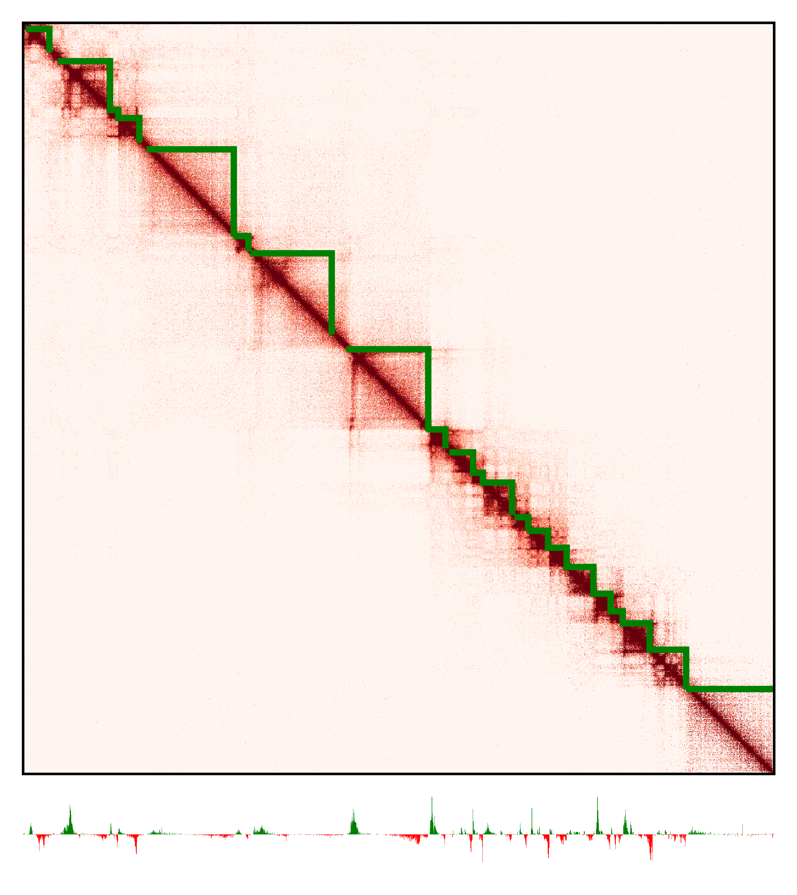
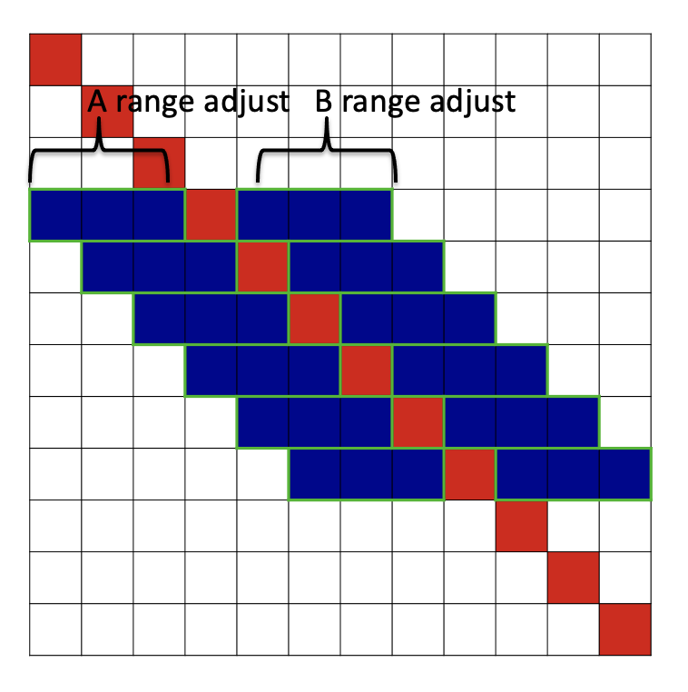
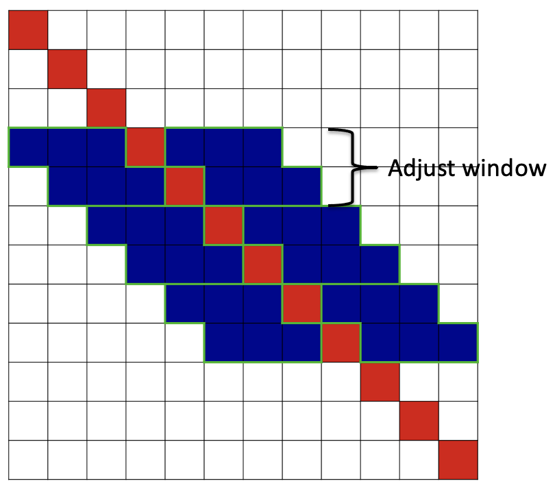

# README #

Directionality Index and Topologically Associating Domain (TAD) calling based on dixon et al. 2012 
(https://www.nature.com/articles/nature14222) 


### How do I get set up? ###

sh setup_venv.sh

To run c code version be sure to compile fwdback2.c and hmmFwdBack.c into shared objects   
gcc -std=c99 fwdback2.c  -fPIC -shared -o _fwdback2.so   
gcc -std=c99 hmmFwdBack.c  -fPIC -shared -o _hmmFwdBack.so   

The wrappers fwdback2c.py and hmmFwdBackc.py are used to pass in  numpy arrays into shared objects   

### Guidelines ###

#### Step 1: Directionality Index and hidden states generation ####

run DI_TAD_calls2Hermitianmodv2_firstaic90.py via:   
sh DI_analysis.sh   


#### Input ####
Arg 1: count file (inside input/ subdirectory)  
Arg 2: bed file (inside input/ subdirectory)   
Arg 3: number of DI bins upstream and downstream (Dixon et al suggest 2 MB - corresponding to 200 with binsize of 10 KB)   
Arg 4: resolution basepair  
Arg 5: window size (Keep as 1, DI calculated across number of diagonal bins)   
Arg 6: gap between DI upstream down stream and diagonal (Keep as 0)    
Arg 7: minimum cluster (2 recommended).  If no optimal calls can be made (i.e. only single or no output hiddenstate), then continually increase.     
Arg 8: name for output (name)_postp_list.csv (located in output directory)    


count file example:
```
   index_row   index_col    value  
   301    301    233.065804
   301    302    112.204466
   301    303    28.487975
   301    304    28.198258
   301    305    24.758131
   301    306    21.975839
   301    307    23.699101
   301    308    16.935819
```

bed file example:
```
    chromosome   start    end   index
    chr1    0   10000   1
    chr1    10000   20000   2
    chr1    20000   30000   3
    chr1    30000   40000   4
    chr1    40000   50000   5
    chr1    50000   60000   6
    chr1    60000   70000   7
    chr1    70000   80000   8
```


#### Output ####
The output (name)_postp_list.csv located in output/ subdirectory is composed of 9 columns:   
col1: chromosome #   
col2: start of coordinate bin      
col3: end of coordinate bin     
col4: DI index   
col5: viterbi path (best of different clusterings (minimum_cluster to 10 cluster mixturecomponents))   
col6: Baum-Welch path (best of different clusterings (minimum_cluster to 10 cluster mixturecomponents))   
col7: probability of state 1 in best of cluster sizes  
col8: probability of state 2 in best of cluster sizes   
col9: probability of state 3 in best of cluster sizes   

(Best of cluster sizes decided by aic)   

#### Step 2: Postprocess ####

sh finalprocess_mod.sh   

Perl scripts designate a TAD as having both an upstream (hiddenstate 3) and downstream (hiddenstate 1) component   


name=output label (Arg8 from DI_analysis.sh)   
chrom_sizes= chromosome sizes (chromosome basepair sizes from hg38, mm10, etc.)     
resolution=resolution base pair   
window_size=window size (Keep as 1, DI calculated across number of diagonal bins) (Arg5 from DI_analysis.sh)    

The output domains provided in output/   
{name}_finaldomains_chr#.bed   
{name}_DIscore.bed (bed file with all DI scores)


#### Step 3: plotting ####
run output/plot_domain_DI.py    
(example: sh plot_domain_DI.sh)    
 
#### Input ####
*name* = sparse balanced heatmap matrix (.npz file corresponding to counts and bed in input/)    
*domain_file* = {name}_finaldomains_chr#.bed (domain output in step 2 in output/)    
*DI_score* = {name}_DIscore.bed  (DI bed output in step 2 in output/)   
*min_DI*  = minimum DI value plotted    
*max_DI*  = maximum DI value plotted    
*chromosome* = chromosome to plot    
*start* = start coordinate to plot    
*end*= end coordinate to plot    
*resolution* = resolution basepair binning of heatmap    
*max_color*  = maximum color value to plot    

#### Output ####
output/*{name}*'_' + args.chr  + '_' + str(start)  + '_' + str(end) + '_' +  str(args.max_color) + '.png'   




#### Notes ####


* Originally tested guassian mixture from 1 cluster to 20 (as original paper).  I have found more recently that it
is more difficult to converge on some higher resolution HiC data sets at cluster 1, resulting in empty calls. I have found
increasing start to 2 to perform better.  I alse hardcoded 10 as maximum cluster test.
* Have tested a range of A/B DI size scales to achieve nested domains. Have encountered a lower limit resulting in 
rank deficient matrix inversion errors (around ~300 kb  range).
* Unused input parameters (gap should be left at 0 (not used) and window should be kept at 1 (not used))   

DI upstream/downstream range:   


DI window:   


DI gap:   


### Contact ###

Daniel Emerson   
demerson368@gmail.com   
